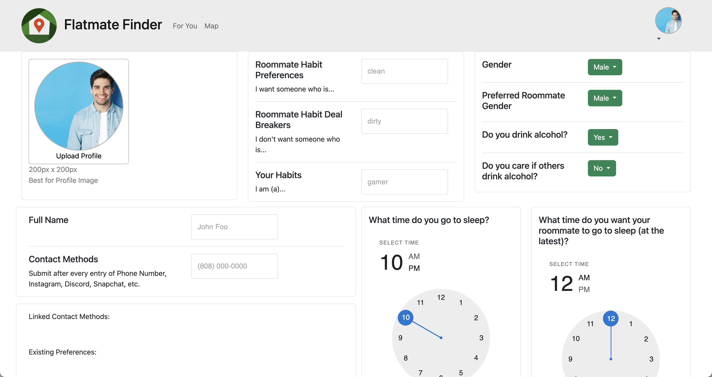
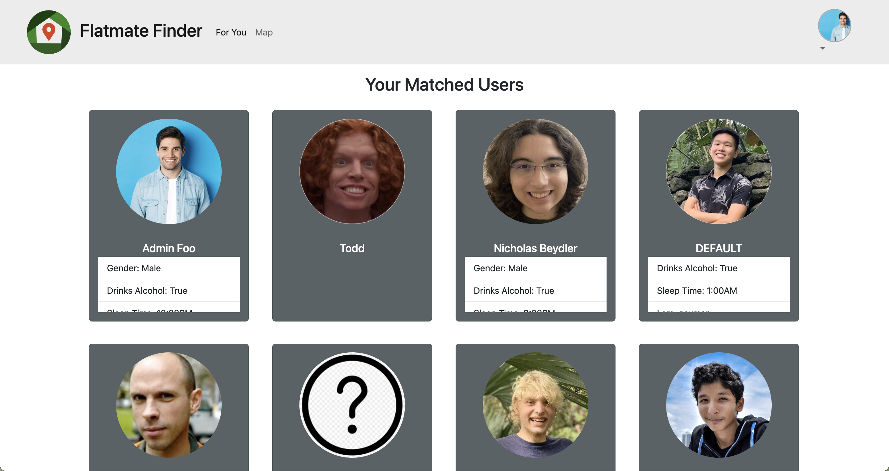
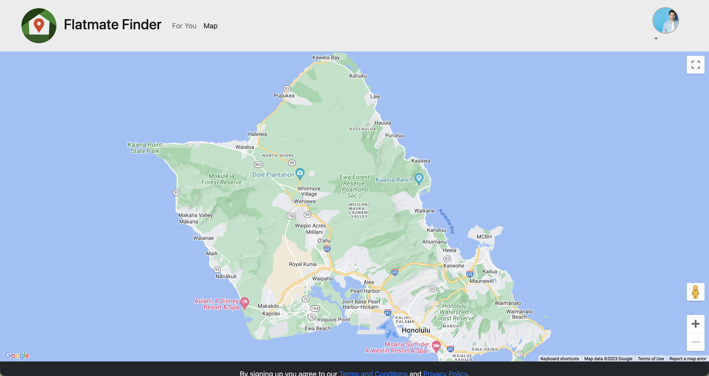
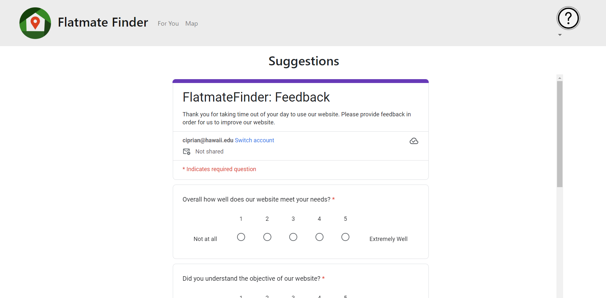
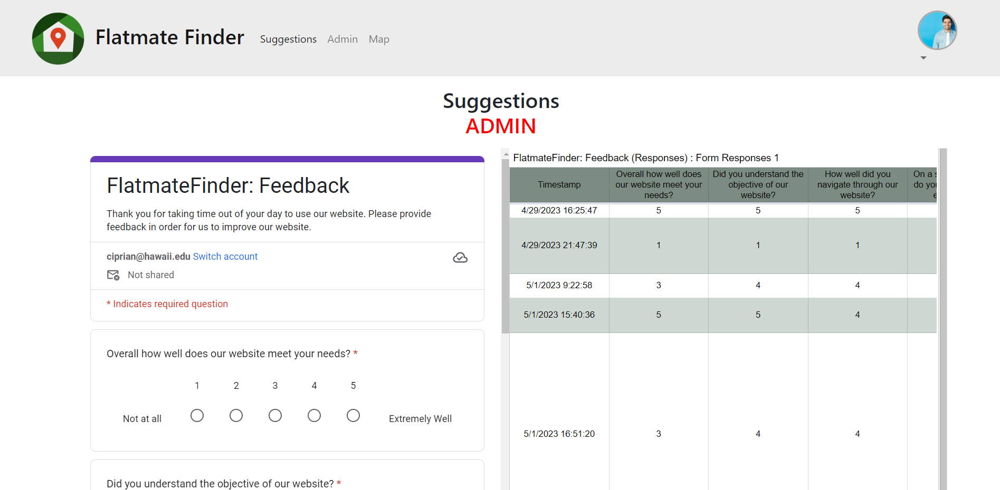

# FlatmateFinder

## Table of contents

* [Overview](#overview)
* [Deployment](#deployment)
* [Phase 1](#Project)
* [Phase 2](#Project)
* [Phase 3](#Project)
* [Team Contract](#contract)
* [Team](#team)

## Overview

FlatmateFinder is a website that is meant to bring people together as roommates. It illustrates various technologies, including:

* [Meteor](https://www.meteor.com/) for Javascript-based implementation of client and server code.
* [React](https://reactjs.org/) for component-based UI implementation and routing.
* [React Bootstrap](https://react-bootstrap.github.io/) CSS Framework for UI design.
* [Uniforms](https://uniforms.tools/) for React and Semantic UI-based form design and display.

The Website rolls out in multiple different phases, we will call these phases Phase 1, Phase 2, and Phase 3.

## Deployment

The website [flatmatefinder.xyz](https://flatmatefinder.xyz/) is our website that links to our deployed web application running on Digital Ocean. It contains HTTPS communication to encrypt the information that flows between the server and the browser. In addition, the web application is hosted using a custom domain name that corresponds to our final project name.

## Github Organization

The web application's source code can be found at our github organization called [flatmatefinder](https://github.com/flatmatefinder).

## User Guide
### Welcome Page

When you first visit [flatmatefinder.xyz](https://flatmatefinder.xyz/), you'll be warmly welcomed to the homepage. From there you can create a new account and profile. 

### Sign Up

The signup page for users to create an account to have access to the map and connect. To create an account, use a UH email address and password. 

### User Landing Page

Once you create an account, there are steps to creating your profile and navigating through the site. 

### Login Page

The login page for users to have access to the map and connect with people in order to find a flatmate. 

### Profile Page

Most importantly, create your profile in order to get paired up with potential roommates! Input data and check the For You page to see you matched with. 

### For You Page

The For You Page is using an algorithm that pairs you with people based on the information you inputted in your Profile. 

### Map Page

The Map Page is where you will be able to place pins on where you are going to be living and then see if there are any people who will be living in the same place or area that you can room with.

### Suggestions Page

After you visited our site if you could suggest some feedback. 

## Phase 1:

### Project

The [milestone 1 project](https://github.com/orgs/flatmatefinder/projects/1/) is a tabular view of all of the issues associated with this milestone.

## Phase 2:

### Project

The [milestone 2 project](https://github.com/orgs/flatmatefinder/projects/2/) is a tabular view of all of the issues associated with this milestone.

## Phase 3:

### Project

The [milestone 3 project](https://github.com/orgs/flatmatefinder/projects/4/) is a tabular view of all of the issues associated with this milestone.

### Suggestions

Allows any user to submit a suggestions form that will show up on an Admin's suggestions page.

Displays on an Admin's suggestions all other user suggestion forms submitted and timestamped.

## Community Feedback

### Arlen
Overall Exerience With Website: 4/5
I liked how easy it was to customize. I think that some of the preferences do not work for the "dealbreakers" and last one.

### Brandon
Overall Exerience With Website: 4/5
Info entered into the profile/account setup should be used throughout the site. (example: name). Not totally intuitive that I need to sign up to begin. that should be a call to action on the homepage. Overall very good. React makes it fast after initial load. :) 

### Abigail
Overall Exerience With Website: 4/5
I thought it was pretty straight to the point. I'm sure it's gonna be very helpful for those looking. I think it's good to have what you're looking for and how you are.	I was a little confused when I was putting in extra information about myself because I know it said to submit earlier, but when I hit enter for the others it would save so I wasn't sure if I was just doing it wrong, but overall it was good.

### Anuhea
Overall Exerience With Website: 3/5
1. choose more professional photo
2. based off chosen photo, color the text boxes accordingly (ex: if you were to use the sunset pic, i'd make the text boxes shades of orange and yellow)
3. make font a little smaller
4. i want to see what john foo's personality would be
5. if can, try add more tabs to utilize the top bar

### Jeremiah
Overall Exerience With Website: 3/5
Issues so far:
* In the CREATE/UPDATE PROFILE page, the text boxes are unable to receive/create new entries after clicking on any of the dropdown menus. They will only work again once the UPDATE button is clicked.
* In the CREATE/UPDATE PROFILE page, clicking OK for either of the intractable clock widgets does nothing that I can see. There's no notification that pops up and says ""... has been updated"" or something.
* In the SETTINGS page, in the DATA VISIBILITY section, the first option will be selected if you click on any text inside the gray box. This behavior is not replicated for any of the other options.
* In the SETTINGS page, in the CUSTOMIZATION section, customizing roadmap colors does not save changes.
* In the SETTINGS page, in the PINS section, I am unsure of what pins are and how they are implemented.

## Contract
Every member of this team has signed and agreed to all of the terms in our [contract](https://docs.google.com/document/d/15glZaHxvn-8OiJt8GSdNYwgJU4knJpIULpwFodKEaSY/edit?usp=sharing).

## Team

FlatmateFinder is designed, implemented, and maintained by [Nicholas Beydler](https://beydlern.github.io/), [Xavier Burt](https://xavierburt.github.io), [Kaysha Kealalio](https://kayshakk.github.io/), [Briana Lee](http://bri111.github.io/), and
[Eric Orozco-Ciprian](https://erickorozcociprian.github.io/), 
