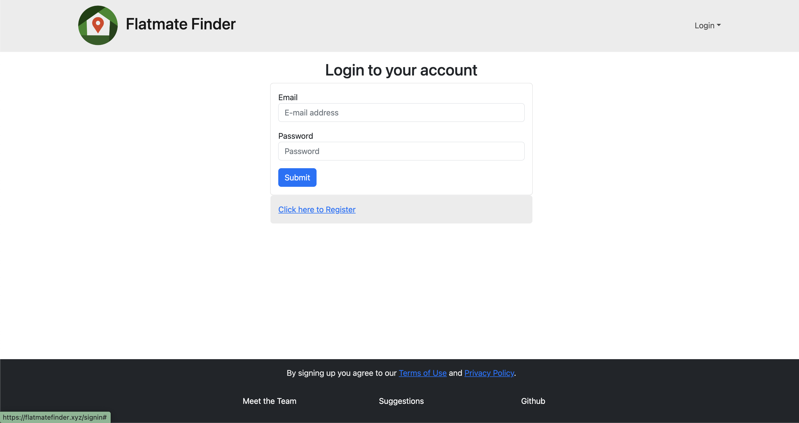
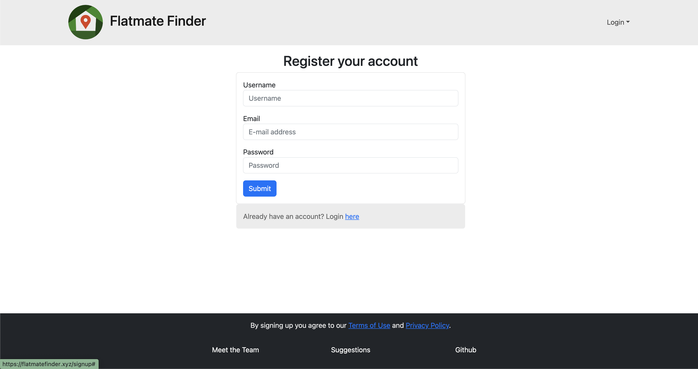
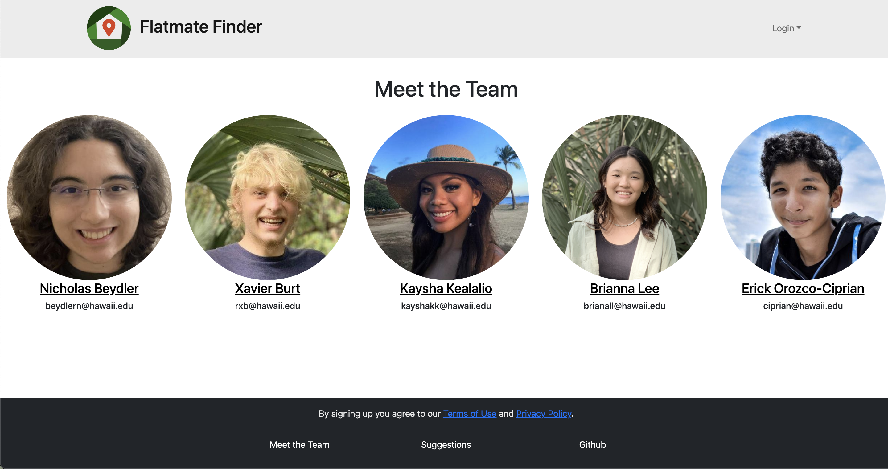
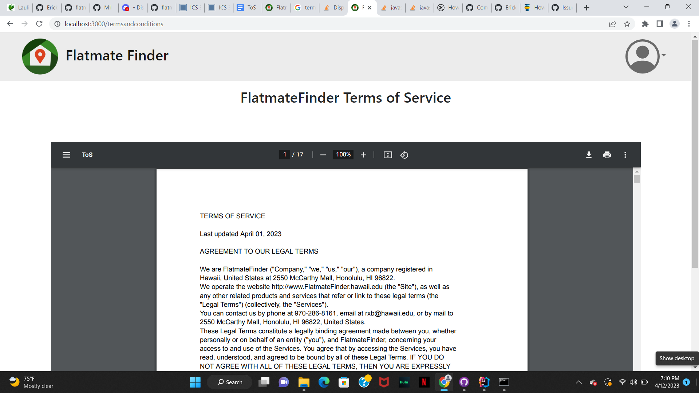

# FlatmateFinder

## Table of contents

* [Overview](#overview)
* [Deployment](#deployment)
* [Phase 1](#overview)
* [Phase 2](#overview)
* [Team Contract](#contract)
* [Team](#team)

## Overview

FlatmateFinder is a website that is meant to bring people together as roommates. It illustrates various technologies, including:

* [Meteor](https://www.meteor.com/) for Javascript-based implementation of client and server code.
* [React](https://reactjs.org/) for component-based UI implementation and routing.
* [React Bootstrap](https://react-bootstrap.github.io/) CSS Framework for UI design.
* [Uniforms](https://uniforms.tools/) for React and Semantic UI-based form design and display.

The Website rolls out in multiple different phases, we will call these phases Phase 1, Phase 2, and Phase 3.

## Deployment

The website [flatmatefinder.xyz](https://flatmatefinder.xyz/) is our website that links to our deployed web application running on Digital Ocean. It contains HTTPS communication to encrypt the information that flows between the server and the browser. In addition, the web application is hosted using a custom domain name that corresponds to our final project name.

## Github Organization

The web application's source code can be found at our github organization called [flatmatefinder](https://github.com/flatmatefinder).

## Phase 1:

### Project

The [milestone 1 project](https://github.com/orgs/flatmatefinder/projects/1/) is a tabular view of all of the issues associated with this milestone.

### Screenshots

On the landing page, the users will be able to gain more understanding about the application.

The login page for users to have access to the map and connect. 

The signup page for users to create an account to have access to the map and connect. 

Meet the team who created the application. 

Here are some terms and conditions we added to our website. 

## Phase 2:

### Project

The [milestone 2 project](https://github.com/orgs/flatmatefinder/projects/2/) is a tabular view of all of the issues associated with this milestone.

## Contract
Every member of this team has signed and agreed to all of the terms in our [contract](https://docs.google.com/document/d/15glZaHxvn-8OiJt8GSdNYwgJU4knJpIULpwFodKEaSY/edit?usp=sharing).

## Team

FlatmateFinder is designed, implemented, and maintained by [Nicholas Beydler](https://beydlern.github.io/), [Xavier Burt](https://xavierburt.github.io), [Kaysha Kealalio](https://kayshakk.github.io/), [Briana Lee](http://bri111.github.io/), and
[Eric Orozco-Ciprian](https://erickorozcociprian.github.io/), 
